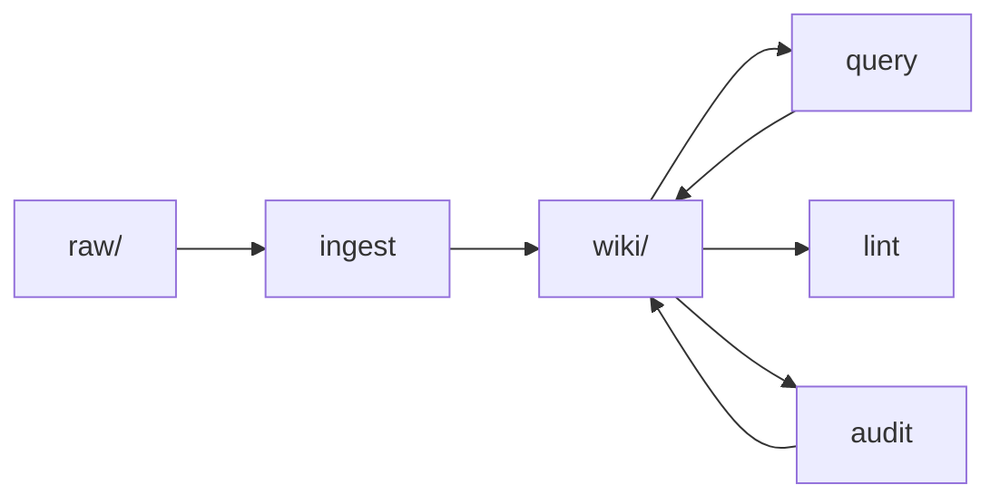

# Oh My AI — 个人 AI 知识库

基于 [LLM Wiki Pattern](https://gist.github.com/karpathy/442a6bf555914893e9891c11519de94f) 构建的个人知识库。

## 核心思想

不同于 RAG（每次查询都重新检索原始文档），LLM Wiki Pattern 让 LLM **将知识编译成持久化的 wiki 页面**——一次编写，多次读取，知识随时间积累和生长。

## 目录结构

| 目录 | 作用 |
|------|------|
| **wiki/** | 核心知识库——LLM 编译后的知识页面，含三大分类索引 |
| **raw/** | 原始源文件（不可变）——网页内容、文档、论文原文等 |
| **summaries/** | 原材料摘要——从外部来源摄取的关键要点 |
| **audit/** | 人类反馈收件箱——存放需要 LLM 处理的人类意见 |
| **log/** | 每日操作日志——每次 ingest、query、lint 等操作的时间戳记录 |
| **outputs/** | 查询结果输出——query 操作的答案输出 |

## 五大操作

1. **`ingest`** — 读取新来源，创建/更新 summary 和概念页面
2. **`query`** — 基于 wiki 回答问题
3. **`lint`** — 健康检查：死链、孤立页面、缺失索引项
4. **`audit`** — 处理人类反馈，修正错误

## Wiki 三大分类

- **01-核心知识** — AI 领域的基础概念、方法论和技术原理
- **02-落地实践** — 基于开源项目的个人扩展和实践项目
- **03-应用工具** — 具体使用的工具和平台

## 相关资源

- [llm-wiki-skill](https://github.com/lewisliu/llm-wiki-skill) — LLM Wiki Pattern 的实现 skill
- [Karpathy's llm-wiki Gist](https://gist.github.com/karpathy/442a6bf555914893e9891c11519de94f) — 原始 Pattern 来源

