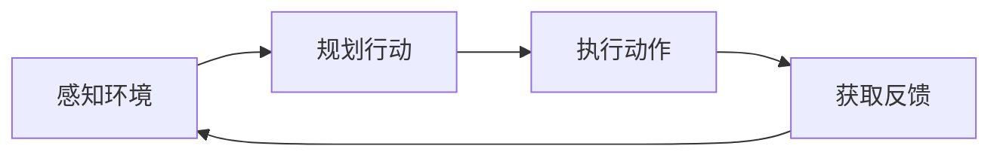

# Agent 基础

## 什么是 Agent

Agent 是一个能够自主感知环境、做出决策并执行动作的系统。与简单的大语言模型不同，Agent 具备：

- **自主性** — 能够独立规划和执行任务
- **工具使用** — 调用外部工具完成任务
- **迭代改进** — 根据反馈调整行动

## Agentic Loop

Agent 的核心循环：

1. **感知 (Perceive)** — 收集环境信息
2. **规划 (Plan)** — 决定下一步行动
3. **执行 (Act)** — 调用工具执行动作
4. **反馈 (Feedback)** — 评估结果，迭代改进

## Related concepts

- [[01-核心知识/AI_Agent/Agent工具调用]] — 如何使用工具
- [[01-核心知识/AI_Agent/Agent规划]] — 规划与推理能力
- [[01-核心知识/Agent编排/AI_Agent_Orchestration]] — 多 Agent 协调
