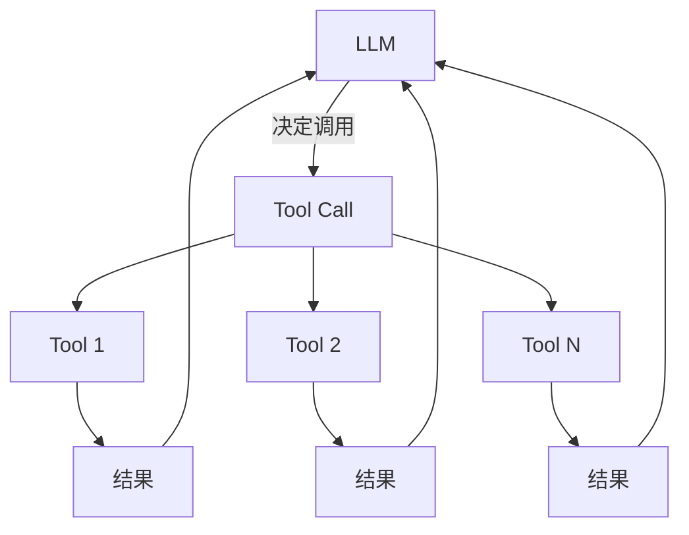

# Agent 工具调用

## Tool Use 概述

Agent 通过调用外部工具来扩展能力，突破 LLM 本身的知识和时间限制。

## 核心机制

- **Function Calling / Tool Use** — LLM 生成结构化的工具调用
- **Tool Discovery** — Agent 如何发现可用的工具
- **Tool Selection** — 从多个工具中选择合适的

## 实现模式

## 工具类型

- **文件操作** — 读、写、编辑
- **Shell 命令** — bash/git/npm 等
- **搜索** — web search、code search
- **API 调用** — 外部服务集成
- **浏览器控制** — 参见 [[01-核心知识/Browser_Automation/Browser_Automation]]

## Related concepts

- [[01-核心知识/AI_Agent/Agent基础]] — agentic loop
- [[01-核心知识/AI_Agent/Agent规划]] — 规划能力
