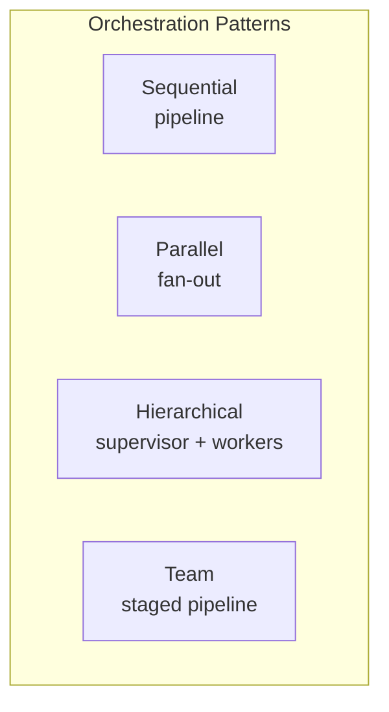

# AI Agent Orchestration

The practice of coordinating multiple AI agents to work together on complex tasks, dividing labor across specialized roles.

## What it is

Single agents can handle straightforward tasks, but complex work benefits from **specialization**. Agent orchestration frameworks coordinate multiple agents, each with a specific role, to tackle multi-faceted problems.

## Core patterns

### Sequential pipeline
One agent's output feeds the next agent's input. Used for linear workflows: explore → analyze → plan → implement → verify.

### Parallel fan-out
Multiple agents work simultaneously on independent subtasks, then results are merged. Used by `ultrawork` mode in OMC — launches N agents at once.

### Hierarchical supervisor
A supervisor agent decomposes tasks and delegates to worker agents. Workers report back to supervisor who synthesizes results.

### Team staged pipeline
A multi-stage pipeline where each stage may spawn multiple agents. OMC's team mode: `team-plan → team-prd → team-exec → team-verify → team-fix`.

## Model routing

Different tasks need different model capabilities:

| Task complexity | Model | Cost |
|-----------------|-------|------|
| Simple lookups, fast tasks | haiku | Low |
| Code implementation, testing | sonnet | Medium |
| Architecture, strategic analysis | opus | High |

Smart routing (as in OMC) automatically selects the right model tier based on task type.

## Specialized agent roles

Common roles in orchestration systems:

| Role | Responsibility |
|------|---------------|
| **explorer** | Codebase discovery, file/symbol mapping |
| **planner** | Task sequencing, execution plan creation |
| **architect** | System design, interface definition |
| **executor** | Code implementation, refactoring |
| **verifier** | Completion verification, test confirmation |
| **reviewer** | Code review, security review |
| **critic** | Gap analysis, challenge plans |

## Implementations

- **oh-my-claudecode** — Team orchestration for Claude Code with 19 specialized agents
- **oh-my-codex** — Same pattern for OpenAI Codex CLI
- **claw-code** — Rust implementation of the agent harness

## Related concepts

- [[01-核心知识/AI_Agent]] — general agent concept
- [[03-应用工具/Claude_Code]] — base agentic coding tool
- [[02-落地实践/oh-my-claudecode]] — concrete orchestration implementation
- [[Team Orchestration]] — staged pipeline pattern
