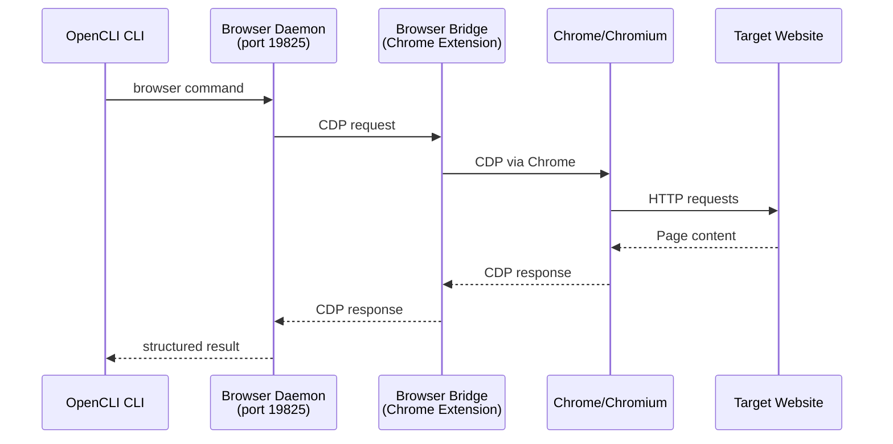

# Browser Automation

Using browser automation to interact with websites programmatically — particularly for AI agents that need to access sites without APIs.

## The problem

Many valuable websites don't have APIs, or have rate-limited/restricted APIs. AI agents that need to gather information or perform actions on these sites are stuck.

Browser automation solves this by **driving a real browser** — same browser you're logged into on your laptop.

## Chrome DevTools Protocol (CDP)

CDP is the underlying protocol that enables browser automation. It's the same protocol Chrome's DevTools uses to control the browser.

OpenCLI's Browser Bridge extension uses CDP to:
- Navigate to pages
- Click elements
- Type text
- Extract content
- Take screenshots
- Monitor network requests

## Architecture

## Key advantage: account-safe

Browser automation reuses your **logged-in Chrome session**. Your credentials never leave the browser — the site sees your real authenticated session, not an API call from a bot.

## Use cases

- **Web scraping** of sites without APIs
- **Automated testing** of web applications
- **AI data gathering** for research
- **Form submission** and interaction
- **Screenshot capture** of pages

## Implementations

- **OpenCLI** — Browser Bridge extension + daemon, with `explore`/`synthesize`/`generate` for AI adapter creation
- **Puppeteer** — Node.js CDP client library
- **Playwright** — Cross-browser automation with API
- **Selenium** — WebDriver-based automation

## Related concepts

- [[03-应用工具/OpenCLI]] — implementation with AI agent integration
- [[Chrome DevTools Protocol]] — underlying protocol
- [[AI Agent Tool Discovery]] — how AI agents use browser automation
