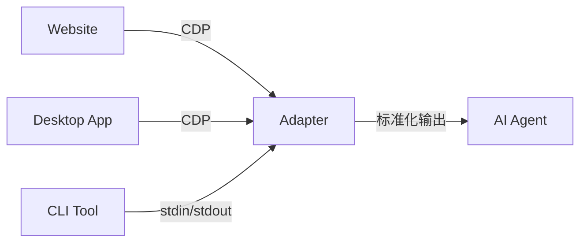

# 适配器模式

将不同接口统一为标准化 CLI 接口的模式。

## 问题

各种工具和网站有完全不同的接口：
- 网站需要点击和表单填写
- 桌面应用需要 CDP 控制
- CLI 工具各有不同参数格式

## 解决方案：适配器

适配器将各种不同接口转换为统一的 CLI 接口：

## 案例

[[03-应用工具/OpenCLI]] 提供了 87+ 预构建适配器，将网站和桌面应用转换为 CLI 接口。

## Related concepts

- [[01-核心知识/CLI_Tools/CLI_Hub]] — 统一发现机制
- [[03-应用工具/OpenCLI]] — 适配器模式的实践实现
