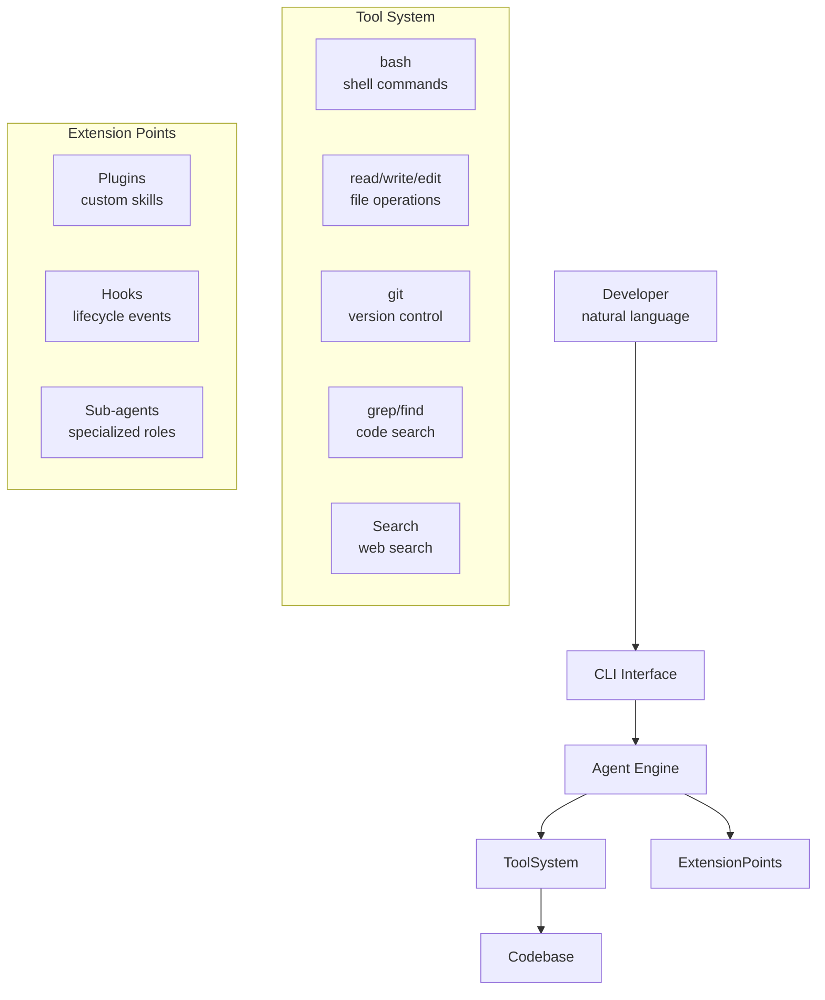

# Coding Agent

A specialized AI agent designed to assist with software development tasks — understanding codebases, writing code, handling git workflows, and executing multi-step development tasks autonomously.

## What it is

Coding agents are terminal-native AI tools that maintain full codebase awareness and can autonomously handle routine development tasks through natural language commands.

Unlike IDE-based completions (Copilot), coding agents:
- Maintain persistent awareness of the entire codebase
- Execute multi-file refactoring tasks
- Handle git workflows (commit, branch, PR)
- Run tests and verify changes
- Work autonomously without constant guidance

## Architecture

## Implementations

| Project | Language | Author | Key feature |
|---------|----------|--------|-------------|
| **Claude Code** | TypeScript | Anthropic | Official product, plugin ecosystem |
| **Claw Code** | Rust | UltraWorkers | Fast Rust reimplementation |
| **oh-my-claudecode** | TypeScript | Community | Multi-agent orchestration on top of Claude Code |

## Comparison

| Feature | Claude Code | Claw Code |
|---------|-------------|-----------|
| Language | TypeScript/Node.js | Rust |
| Performance | Good | ~2-10x faster startup |
| Plugin ecosystem | Extensive | Growing |
| Official support | Yes | Community |

## Related concepts

- [[01-核心知识/AI_Agent]] — general agent concept
- [[01-核心知识/Agent编排/AI_Agent_Orchestration]] — multi-agent coordination
- [[03-应用工具/Claude_Code]] — concrete implementation
- [[03-应用工具/Claw_Code]] — Rust reimplementation
- [[02-落地实践/oh-my-claudecode]] — orchestration layer
