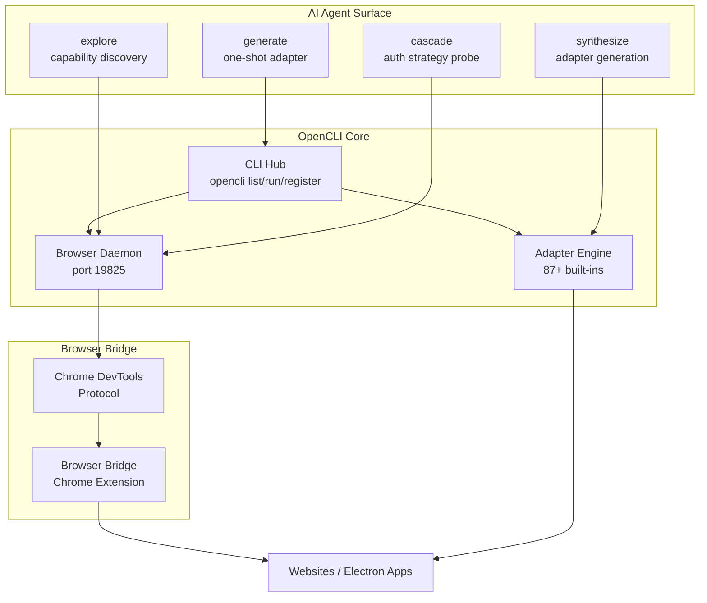

# OpenCLI

Turns websites, browser sessions, Electron apps, and local tools into deterministic CLI interfaces for both humans and AI agents.

## What it is

OpenCLI solves the problem of **AI agents无法访问没有 API 的网站** by combining browser automation with a adapter framework. Instead of requiring sites to have APIs, it drives the actual browser (reusing your logged-in session) to interact with sites programmatically.

The three automation surfaces:
1. **Built-in adapters** — 87+ pre-built commands (`opencli hackernews top`, `opencli bilibili hot`, etc.)
2. **Live browser** — `opencli browser` for real-time page interaction: click, type, extract, screenshot
3. **Adapter generation** — `explore` → `synthesize` → `generate` pipeline that creates new adapters from real browser behavior

## Architecture



Key components:
- **Browser Bridge extension** — lightweight Chrome extension + daemon; reuses your Chrome login session
- **CLI Hub** — unified discovery surface for both built-in commands and local binaries (`gh`, `docker`, `obsidian`)
- **Adapter engine** — evaluates JS-based adapters deterministically; output formats: table/json/yaml/md/csv

## Browser automation

`opencli browser` commands give AI agents direct control:

| Command | Purpose |
|---------|---------|
| `open` | Navigate to URL |
| `state` | Get DOM state snapshot |
| `click` | Click element |
| `type` | Type text |
| `select` | Select dropdown option |
| `get` | Extract text/content |
| `screenshot` | Capture page |
| `network` | Monitor network activity |

## CLI Hub

OpenCLI doubles as a **universal hub for local CLI tools**:

```bash
opencli list              # show all registered commands
opencli gh pr list        # passthrough to gh
opencli docker ps         # passthrough to docker
opencli obsidian search   # passthrough to obsidian
opencli register mycli    # register your own CLI
```

Auto-installs missing tools via `brew install`.

## Desktop app adapters

Control Electron desktop apps via CDP:

| App | Capability |
|-----|-----------|
| Cursor | Composer, chat, code extraction |
| Codex | Drive OpenAI Codex CLI headlessly |
| ChatGPT | Automate macOS ChatGPT app |
| Notion | Search, read, write pages |
| Discord | Messages, channels, servers |

## Zero LLM cost

Commands run entirely locally — **no tokens consumed at runtime**. A command can be run 10,000 times for free. Only the `explore`/`generate` AI-assisted adapter creation uses LLM calls.

## Related concepts

- [[01-核心知识/Browser_Automation/Browser_Automation]] — underlying CDP-based browser control
- [[01-核心知识/CLI_Tools/CLI_Hub]] — unified tool discovery pattern
- [[AI Agent Tool Discovery]] — how AI agents discover capabilities via AGENT.md integration
- [[Electron App CLI]] — turning desktop apps into CLI tools

## Sources

- [[summaries/opencli]] — (2026-04-14) OpenCLI project summary
