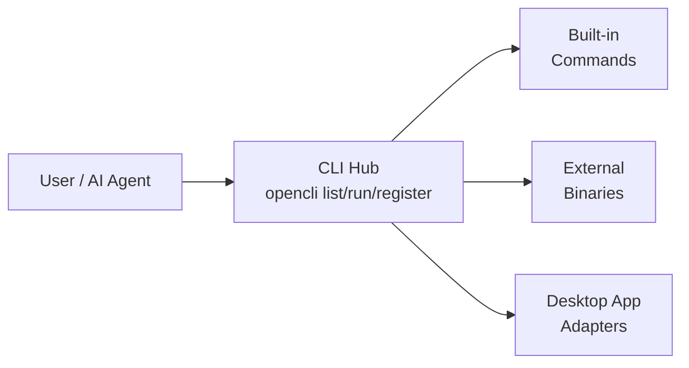

# CLI Hub

A unified discovery and execution surface for multiple command-line tools — both built-in commands and external binaries.

## What it is

Instead of remembering syntax for dozens of different CLI tools, a CLI hub provides:
- **Unified discovery** — `list` shows all available commands
- **Consistent interface** — same command pattern for all tools
- **Auto-install** — installs missing tools automatically
- **AI-friendly** — AI agents can discover and use tools through the same surface

## Pattern



## Implementations

### OpenCLI

OpenCLI is primarily a CLI hub for:
- **87+ built-in web adapters** (Twitter, Reddit, HackerNews, etc.)
- **Local binaries** (gh, docker, obsidian, lark-cli, etc.)
- **Desktop Electron apps** (Cursor, Codex, ChatGPT, Notion, Discord)

```bash
opencli list                        # show all commands
opencli gh pr list                  # GitHub CLI
opencli docker ps                   # Docker
opencli cursor composer "..."        # Desktop app
opencli register mycli              # register custom CLI
```

Auto-install: if `gh` isn't installed, OpenCLI runs `brew install gh` automatically.

### Benefits for AI agents

AI agents can discover available tools through the hub without:
- Knowing ahead of time what tools are installed
- Handling installation of missing tools
- Remembering different syntax for each tool

## Related concepts

- [[OpenCLI]] — concrete CLI hub implementation
- [[AI Agent Tool Discovery]] — how agents find and use tools
