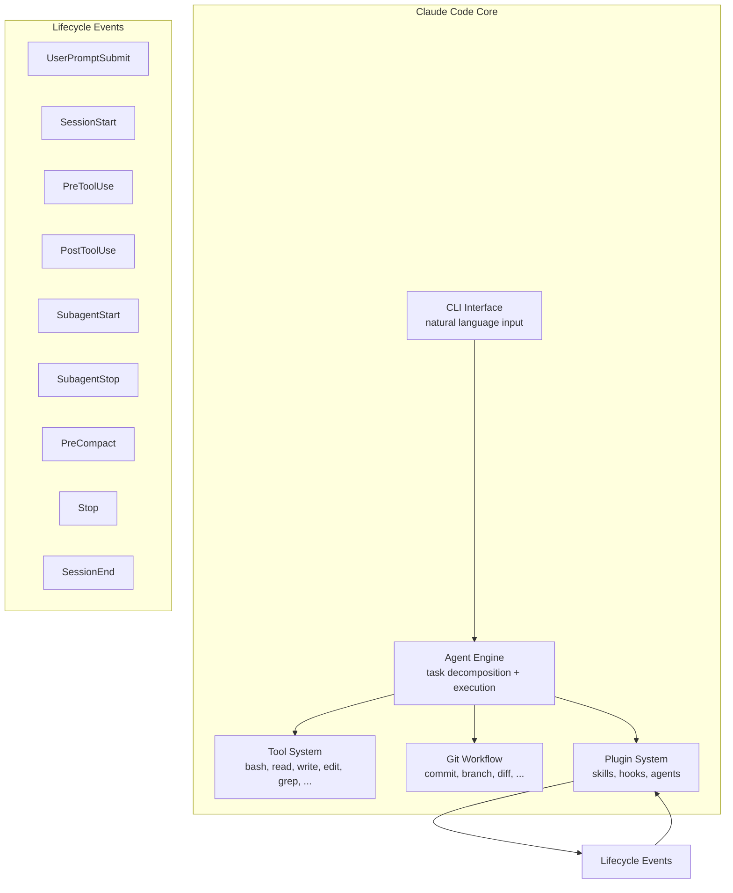

# Claude Code

Anthropic's agentic coding tool — a terminal-native AI assistant that understands your codebase and executes software development tasks through natural language.

## What it is

Claude Code lives in the terminal and acts as an autonomous coding agent. Unlike IDE plugins (Copilot, Cursor), it maintains full codebase awareness, handles git workflows, executes multi-step tasks, and can run routine work without constant human guidance.

Installation:
```bash
# Mac/Linux
curl -fsSL https://claude.ai/install.sh | bash
# Windows
irm https://claude.ai/install.ps1 | iex
```

## Architecture



## Plugin system

Claude Code has a rich plugin/extension system:

- **Slash skills** (`/team`, `/autopilot`, `/ralph`) — command-like invocations
- **Agents** — specialized sub-agents (`oh-my-claudecode:executor`, etc.)
- **Hooks** — code reacting to lifecycle events (keyword detection, state persistence)
- **Prompt triggers** — natural language patterns that activate behaviors

Built-in plugins: `code-review`, `feature-dev`, `frontend-design`, `security-guidance`, `hookify`, `plugin-dev`, etc.

## Lifecycle hooks

11 events plugins can hook into:

| Event | When | Use |
|-------|------|-----|
| `UserPromptSubmit` | User submits prompt | Keyword detection, skill injection |
| `SessionStart` | Session begins | Project memory load, initial setup |
| `PreToolUse` | Before tool call | Permission validation |
| `PostToolUse` | After tool call | Result validation, memory update |
| `SubagentStart/Stop` | Subagent lifecycle | Tracking, output verification |
| `PreCompact` | Before context compaction | State preservation |
| `Stop` | Claude about to stop | Persistent mode enforcement |
| `SessionEnd` | Session ends | Cleanup |

## How it differs from alternatives

| Feature | Claude Code | Copilot (IDE) | Cursor |
|---------|-------------|---------------|--------|
| **Interface** | Terminal | IDE sidebar | IDE + Composer |
| **Codebase awareness** | Full repo | File-level | Full repo |
| **Git workflows** | Native | Limited | Limited |
| **Multi-file tasks** | Autonomous | Assist | Assist |
| **Extensibility** | Plugin/hook system | API | SDK |

## Data and privacy

Claude Code collects usage data and feedback (via `/bug` command). Data is not used for model training. Retention periods apply to sensitive information.

## Related concepts

- [[AI Agent]] — general AI agent concept
- [[Coding Agent]] — specialized agents for software development
- [[oh-my-claudecode]] — orchestration layer built on Claude Code
- [[Claw Code]] — Rust reimplementation of the agent harness
- [[Plugin System]] — extensibility patterns for AI tools

## Sources

- [[summaries/claude-code]] — (2026-04-14) Claude Code project summary
