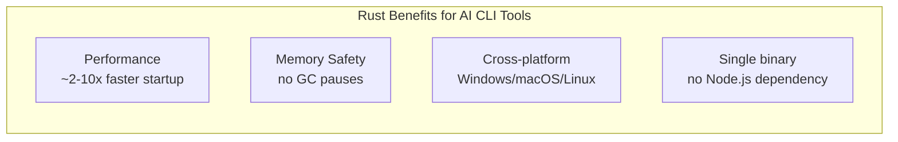
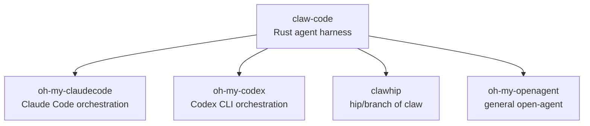

# Claw Code

The public Rust implementation of the `claw` CLI agent harness — built by UltraWorkers. The fastest GitHub repo to reach 100k stars.

## What it is

Claw Code is a **community-driven Rust reimplementation** of the Claude Code agent harness pattern. It provides the same CLI agent functionality as Claude Code but in Rust for performance and portability.

Key facts:
- **Build from source only** — `cargo install claw-code` on crates.io is a deprecated stub
- **Not affiliated with Anthropic** — this is a clean-room implementation
- Auth requires **API key** (`ANTHROPIC_API_KEY`), not a Claude subscription
- Health check: `claw doctor`

## Why Rust



Rust provides:
- **Fast startup** — critical for CLI tools invoked frequently
- **Memory safety without GC** — no unpredictable pauses during agentic tasks
- **Single binary deployment** — no runtime dependency on Node.js/Python
- **Cross-platform** — native Windows support without WSL

## Architecture

The `rust/` workspace contains the canonical implementation:

```
rust/
├── Cargo.toml           # workspace root
├── crates/              # internal crates
├── src/                 # main claw binary
└── tests/               # integration tests
```

Key commands:
```bash
cargo build --workspace   # build everything
cargo test --workspace   # run test suite
./target/debug/claw doctor   # health check
./target/debug/claw prompt "say hello"  # run prompt
```

## Ecosystem

UltraWorkers maintains a complete agent tooling stack:



## Comparison to Claude Code

| Aspect | Claude Code | Claw Code |
|--------|-------------|-----------|
| **Language** | TypeScript/Node.js | Rust |
| **Author** | Anthropic | UltraWorkers (community) |
| **Auth** | Subscription or API key | API key only |
| **Install** | Official installer | Build from source |
| **Affiliation** | Official Anthropic | Independent |
| **Performance** | Good | Faster (Rust) |

## Related concepts

- [[Claude Code]] — the original this reimplements
- [[Rust for AI Tools]] — why Rust for AI CLI tooling
- [[AI Agent Harness]] — CLI framework pattern
- [[UltraWorkers]] — the organization behind this ecosystem

## Sources

- [[summaries/claw-code]] — (2026-04-14) Claw Code project summary
