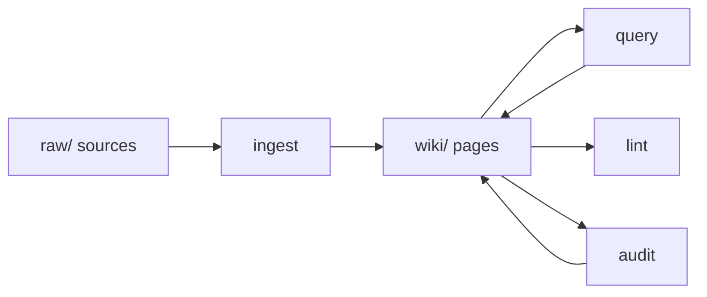

# LLM Wiki Pattern

A Karpathy-style knowledge base pattern where an LLM continuously compiles raw sources into a persistent, cross-linked Markdown wiki. Unlike RAG which re-retrieves raw docs on every query, the LLM **writes** wiki pages that persist and grow over time.

## What it is

The pattern was popularized by Andrej Karpathy's [llm-wiki Gist](https://gist.github.com/karpathy/442a6bf555914893e9891c11519de94f). Instead of treating LLM context as ephemeral scratch space, the wiki becomes a durable artifact that compounds in value — every `ingest`, `query`, `lint`, and `audit` pass makes it richer.

The division of labor:
- **Human owns**: sourcing raw material, asking good questions, steering direction, filing feedback
- **LLM owns**: all writing, cross-referencing, filing, bookkeeping, and acting on feedback

## Five operations

1. **`ingest`** — read a new source, create a summary page, update/create concept pages
2. **`query`** — answer questions grounded in the wiki, promote durable answers
3. **`compile`** — restructure oversized pages, merge duplicates, rebuild index
4. **`lint`** — health check: dead links, orphan pages, missing index entries
5. **`audit`** — process human feedback from `audit/` directory

## Divide and conquer

A single page should target **400–1200 words**. When a topic exceeds that:
- Create `wiki/concepts/<topic>/index.md` — definition + map of sub-pages
- Create `wiki/concepts/<topic>/<aspect-1>.md`, `wiki/concepts/<topic>/<aspect-2>.md`, etc.
- Link the index with `[[concepts/Foo/index|Foo]]`

## Related patterns

- [[Retrieval Augmented Generation]] — contrast: RAG retrieves on every query; wiki writes once, reads many times
- [[AI Agent]] — the LLM acting as both reader and writer of the wiki is itself an agentic pattern

## Sources

- [[summaries/llm-wiki-skill-readme]] — (2026-04-14) llm-wiki-skill implementation
