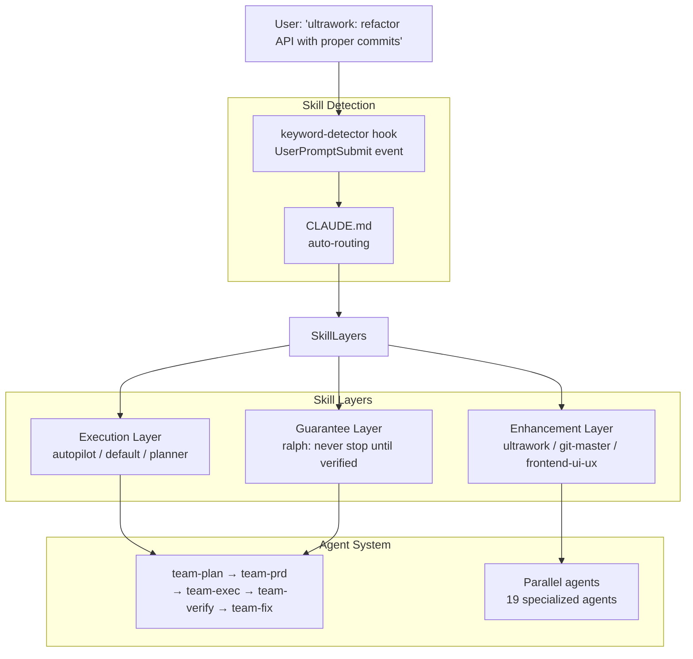

# oh-my-claudecode (OMC)

Multi-agent orchestration layer for Claude Code. Zero learning curve — natural language activates specialized agents and pipelines.

## What it is

OMC extends Claude Code with team orchestration, magic keywords, and persistent execution modes. Instead of learning Claude Code commands, users describe what they want in natural language and OMC routes to the right skill/agent pipeline.

The core philosophy: **Don't learn Claude Code. Just use OMC.**

## Architecture



**Skill composition formula:** `[Execution Skill] + [0-N Enhancements] + [Optional Guarantee]`

## 19 Specialized Agents

Organized in 4 lanes:

| Lane | Agents |
|------|--------|
| **Build/Analysis** | explore, analyst, planner, architect, debugger, executor, verifier, tracer |
| **Review** | security-reviewer, code-reviewer |
| **Domain** | test-engineer, designer, writer, qa-tester, scientist, git-master, document-specialist, code-simplifier |
| **Coordination** | critic |

Model routing: **haiku** (fast/cheap) → **sonnet** (balanced) → **opus** (high-quality reasoning)

## Core execution modes

| Mode | Trigger | Behavior |
|------|---------|----------|
| **autopilot** | `autopilot`, `build me`, `I want a` | Full 5-stage pipeline: idea → working code |
| **ralph** | `ralph`, `don't stop`, `must complete` | Loop until verifier confirms done |
| **ultrawork** | `ultrawork`, `ulw` | Maximum parallelism, multiple agents at once |
| **team** | `/team N:executor "..."` | N agents with staged pipeline |
| **ccg** | `ccg` | Claude + Codex + Gemini tri-model synthesis |
| **ralplan** | `ralplan` | Planner + Architect + Critic reach consensus |

## Hook system

11 lifecycle events. Key hooks:

- **keyword-detector** — fires on `UserPromptSubmit`, detects magic keywords, activates skills
- **persistent-mode** — fires on `Stop`, prevents stopping when ralph/ultrawork active
- **pre-compact** — saves critical state to notepad before context compaction
- **subagent-tracker** — tracks running agents, validates output

## State management

`.omc/` directory survives context compaction:

```
.omc/
├── notepad.md           # compaction-resistant memo pad
├── project-memory.json  # project knowledge across sessions
├── state/               # per-mode state (autopilot, ralph, team)
├── plans/               # execution plans
└── notepads/            # per-plan learnings/decisions/issues
```

Notepad content is **re-injected after compaction** — critical for persistent modes.

## OpenClaw integration

6 hook events forward to OpenClaw gateway:

| Event | Trigger |
|-------|---------|
| `session-start` | Session begins |
| `stop` | Claude response completes |
| `keyword-detector` | Every prompt submission |
| `ask-user-question` | Claude requests user input |
| `pre-tool-use` | Before tool invocation |
| `post-tool-use` | After tool invocation |

## Related concepts

- [[AI Agent Orchestration]] — multi-agent coordination patterns
- [[Magic Keyword Detection]] — implicit skill activation
- [[Claude Code]] — the underlying tool OMC extends
- [[Team Orchestration]] — staged pipeline multi-agent pattern
- [[Context Compaction]] — how OMC handles context window limits

## Sources

- [[summaries/oh-my-claudecode]] — (2026-04-14) OMC project summary
